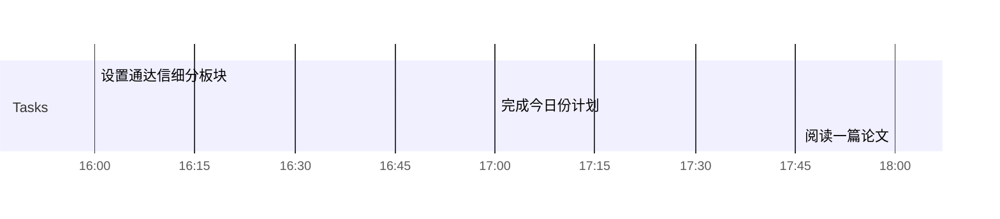

## Day Planner

```mermaid
gantt
    dateFormat  HH-mm
    axisFormat %H:%M
    %% Current Time: 6:59:45 PM
    section Tasks
    设置通达信细分板块     :16-00, 60mm
    完成今日份计划     :17-00, 60mm
    阅读一篇论文     :18-00, 0mm
    section Breaks

```

- [x] 16:00 设置通达信细分板块
- [x] 17:00 完成今日份计划
- [x] 18:00 阅读一篇论文 [zotero-link](zotero://select/library/items/4V43KYKN) [[kim2021joms&t]]